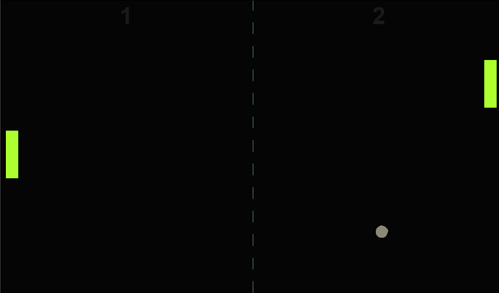

# Pong-Python
Pong game I created during my 100 days of code challenge.
  

 

Tweak the settings using Settings.py file

## How to Run:
1. Clone repository. 
2. Run pong_main.exe from the "dist/" folder if you are on Windows. 
3. Or run pong_main.py

## How to Play:
1. Use 'Up' and 'Down' arrow keys to move your paddle. 
2. If in Multiplayer mode, use 'W' and 'S' keys.

## How to build Windows executable from source
1. Clone the repository 
2. Get PyInstaller https://pypi.org/project/pyinstaller/
3. Run "pyinstaller --onefile pong_main.py" 

## Features:
Single and Multiplayer modes. 
Ball serves are randomized. 
Customizable game colors from Tkinter color list. 
Set game length. 
Set paddle length for increased difficulty. 

